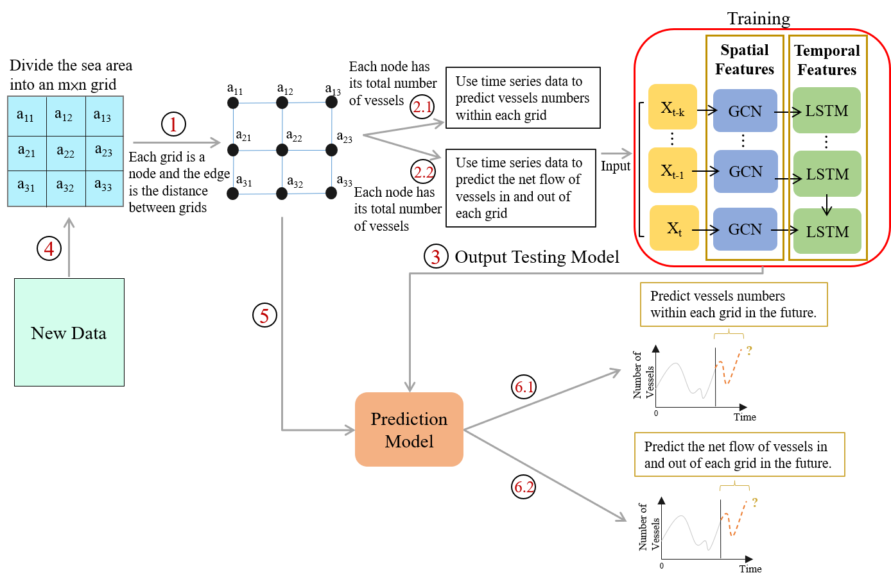
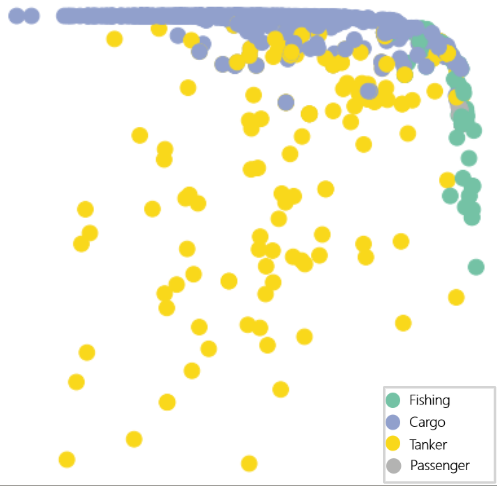

# vessel-classification
Spatio-temporal vessel classification using Graph Neural Networks (GNN) and LSTM based on AIS maritime data.

## Overview
This project focuses on vessel type classification using AIS (Automatic Identification System) data for maritime traffic analysis around the Taiwan Strait.

The goal is to explore both spatial relationships and temporal feature representations for improving vessel classification performance.

Two deep learning approaches are used:
* Long Short-Term Memory (LSTM) as a baseline model
* Graph Neural Network (GNN) for spatial relationship modeling

## Objective
Classify vessels into four categories:
* Fishing
* Cargo
* Tanker
* Passenger

## My contribution
- Performed AIS data preprocessing and anomaly filtering using vessel kinematic constraints.
- Designed feature engineering pipeline based on vessel attributes and trajectory information.
- Implemented LSTM and Graph Neural Network (GNN) models for vessel classification.
- Assisted in constructing the modeling workflow.

## Study Architecture


## GNN classification result
> Accuracy: 83.56% <br>


## Tech Stack
- Python
- TensorFlow
- Pandas
- NumPy
- GNN
- LSTM

## Repository Structure
```text
vessel-classification/
├── README.md
├── images/
│   ├── GNN_Result.png
│   ├── Methodology.png
├── src/
│   ├── LSTM.py
│   ├── GNN.py
```
